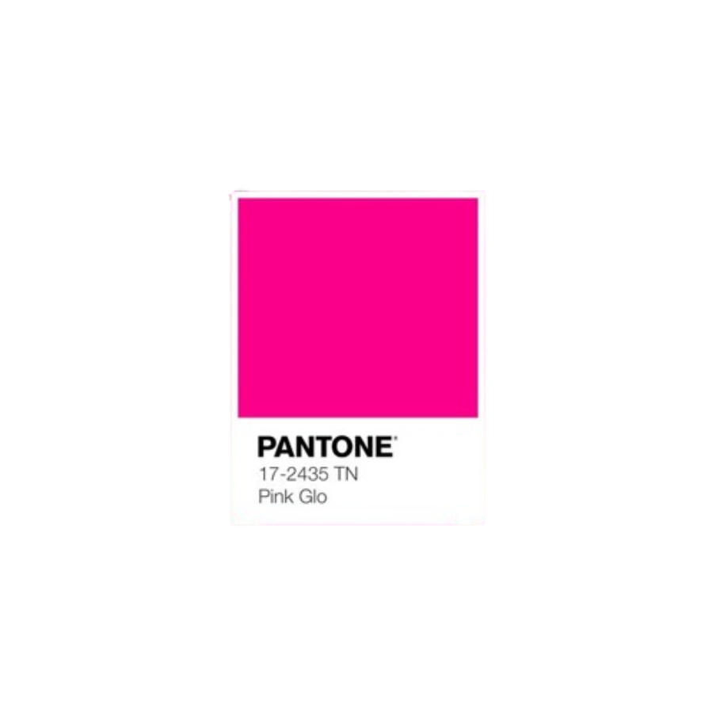

Hi! I'm Yasna Ahmadi, a freshman at Del Norte High School. I love to bake, cook, draw, and play tennis. My favorite color is pink, lavender, and navy blue.

  
  
  
  

[GITHUB](https://github.com/yasna459/yascoolblog)

[TOOLS CHECK](https://yasna459.github.io/yascoolblog/devops/tools/verify)
